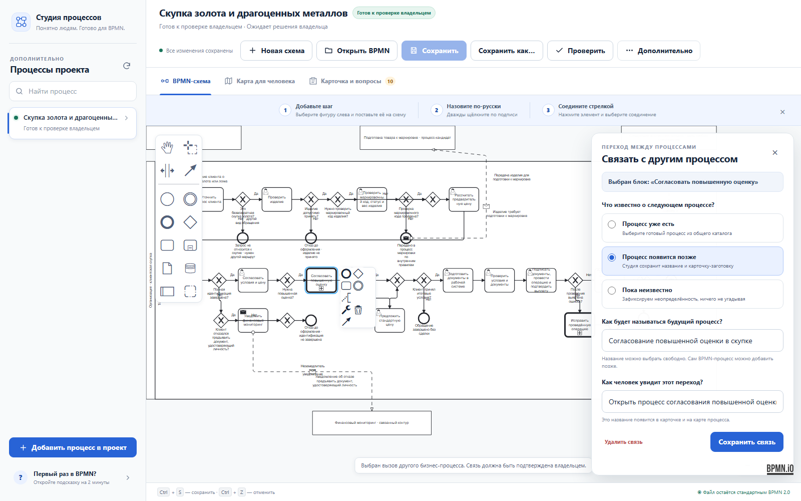

# Локальная BPMN-студия и комплект бизнес-процессов

Это готовый автономный набор для описания бизнес-процессов. В одном проекте
собраны графический BPMN-редактор, проверка схем, человекочитаемые карты
Archify, переходы между процессами, реестр версий и MCP-интерфейс для ИИ-агентов.

Главный результат работы — обычный стандартный файл BPMN 2.0. Его можно открыть
в другом совместимом редакторе, передать разработчику или адаптировать под
Camunda, Flowable и другой BPMN-движок. Проект не запирает схему в собственном
формате.

Для первого использования не нужны знания XML, командной строки и внутренних
идентификаторов. ИИ также не обязателен: весь основной сценарий работает
локально и управляется мышью.

## Что даёт этот проект

| Кому | Что можно сделать | Что получится |
|---|---|---|
| Аналитику или сотруднику | Нарисовать процесс в понятном графическом редакторе | Переносимый файл `.bpmn` |
| Владельцу процесса | Посмотреть маршрут, роли, решения, вопросы и связи без изучения BPMN | Карта Archify и карточка процесса |
| Разработчику | Получить проверенную нейтральную модель | Основа для реализации в BPMN-движке |
| Команде | Вести несколько связанных процессов и переходить из одного в другой | Реестр процессов и Call Activity |
| ИИ-агенту | Читать, создавать, сохранять и проверять BPMN штатными командами | Локальный MCP без доступа к внешнему облаку |

## Как всё работает

1. Пользователь открывает локальную Студию одним CMD-файлом.
2. Встроенный `bpmn-js` рисует и сохраняет стандартный BPMN 2.0.
3. Проверки находят повреждённую XML-структуру, незавершённые связи и ошибки
   управляемого пакета.
4. При необходимости схема оформляется как процесс проекта: к ней добавляются
   понятная карточка, вопросы владельцу и ссылки на основания.
5. Archify строит из BPMN отдельную карту для чтения человеком. Карта не
   заменяет исходный BPMN и пересобирается после его изменения.
6. Call Activity связывает процесс со следующим процессом. Если цель ещё не
   известна, система честно сохраняет незакрытый вопрос, а не придумывает ответ.
7. Технически корректный процесс остаётся черновиком, пока уполномоченный
   владелец не зафиксирует бизнес-решение.

## Начать за минуту

1. Установите [Node.js 22.12 или новее](https://nodejs.org/), если его ещё нет.
2. Клонируйте репозиторий или скачайте архив.
3. Дважды щёлкните `ОТКРЫТЬ-BPMN-РЕДАКТОР.cmd`.
4. Нажмите **«Новая схема»** или **«Открыть BPMN»**.
5. Рисуйте мышью и нажмите **«Сохранить как…»**. Имя файла и папку выбираете
   вы сами.

Название может быть любым: русским, английским, цифровым или внутренним. Для
блоков процесса редактор лишь рекомендует понятные человеку формулировки.

Редактор работает локально на `127.0.0.1` и не отправляет схему во внешний
сервис. ИИ не нужен.

## Что находится внутри

| Компонент | Назначение | Важная граница |
|---|---|---|
| [bpmn-js](https://github.com/bpmn-io/bpmn-js) | Готовая open-source рисовалка BPMN | Сохранена в `vendor/bpmn-js`, поэтому редактор не скачивается при каждом запуске |
| Студия BPMN | Русская оболочка: новый файл, открытие, перетаскивание, `Ctrl+S`, проверка | Работает локально на `127.0.0.1` |
| BPMN-пакет | Схема, карточка, вопросы, основания, решения и производные файлы | Черновик не становится утверждённым автоматически |
| Archify | Интерактивная карта маршрута для человека | Производное представление, а не источник процесса |
| Реестр и навигатор | Каталог процессов и переходы в следующий процесс | Цель определяется по постоянному ID, неизвестная цель остаётся незакрытой |
| MCP | Нативный интерфейс к тем же операциям для Codex, Claude, Cursor и других агентов | Агент не может подменить решение владельца |
| Автоматические проверки | Проверка BPMN, связей, артефактов, лицензий и воспроизводимости | Техническая проверка не равна бизнес-приёмке |

В комплект также входит осмысленная стартовая схема:
**получить запрос → уточнить данные → принять решение → выполнить работу или
завершить без результата**. Её можно сразу изменить под свой процесс.

Мы не писали собственный движок рисования. Интерфейс использует готовый
`bpmn-js`, а проект добавляет русский сценарий, файловую работу, проверки,
Archify, безопасные связи между процессами и управляемый жизненный цикл.



## Два режима

| Нужно | Что выбрать | Что получится |
|---|---|---|
| Просто нарисовать схему | «Новая схема» или «Открыть BPMN» | Обычный переносимый `.bpmn` в любой выбранной папке |
| Вести процесс в общем проекте | «Дополнительно» → «Показать процессы проекта» | BPMN, карточка, вопросы, карта Archify, реестр и переходы |

Файловый режим ничего не создаёт в `processes/` без вашего действия. Пакетный
режим нужен только тогда, когда схему требуется совместно проверять,
регистрировать и передавать разработчику как управляемую версию.

## Как рисовать

- круг — начало или результат;
- прямоугольник — действие;
- ромб — вопрос с вариантами ответа;
- дорожка — роль или участник;
- стрелка — порядок выполнения.

Подписывайте действия глаголом и результатом: например, «Проверить документ».
Для развилки задавайте вопрос, а на исходящих стрелках пишите ответы «Да»,
«Нет» или более точные условия.

Полная инструкция: [графическое создание процесса](docs/ГРАФИЧЕСКОЕ-СОЗДАНИЕ-ПРОЦЕССА.md).

## Переход в следующий процесс

В управляемом процессе выберите задачу и сделайте её стандартным BPMN-элементом
**Call Activity**. Затем в панели связи выберите:

- уже готовый процесс;
- будущий процесс;
- пока неизвестную цель.

Для готовой цели Студия открывает следующий процесс в том же окне. Для будущей
цели сохраняется понятная карточка-заглушка. Неизвестная цель не подменяется
догадкой. В самом BPMN остаётся стандартный `calledElement`, поэтому файл не
привязан к конкретному движку.

Подробнее: [переходы между BPMN-процессами](docs/ПЕРЕХОДЫ-МЕЖДУ-BPMN-ПРОЦЕССАМИ.md).

## Archify в один клик

Archify не заменяет BPMN и не является второй рисовалкой. Это производная
человекочитаемая карта для руководителя или сотрудника.

1. Откройте управляемый процесс.
2. Выберите **«Дополнительно» → «Показать процессы проекта»** и откройте процесс.
3. Перейдите на вкладку **«Карта для человека»** и нажмите
   **«Построить карту Archify»**.

Каноническим исходником остаётся `.bpmn`. После его изменения Студия помечает
старую карту как устаревшую и предлагает пересобрать её.

Подробнее: [Archify и BPMN](docs/ARCHIFY-И-BPMN.md).

## Готовый пример

Процесс **«Скупка золота и драгоценных металлов»** показывает полный комплект:

| Материал | Для чего |
|---|---|
| [Карта процесса](processes/skupka-zolota/map/process-map.png) | Быстро понять маршрут человеку |
| [Карточка](processes/skupka-zolota/process-card.md) | Увидеть цель, границы, роли и вопросы |
| [BPMN-схема](processes/skupka-zolota/bpmn/derived/process.svg) | Просмотреть полную логику в GitLab |
| [Исходный BPMN 2.0](processes/skupka-zolota/bpmn/process.bpmn) | Открыть в любом совместимом редакторе или движке |

## Для разработчика

Разработчик получает нейтральный `process.bpmn`, а не картинку и не
проприетарный файл редактора. Исполняемые настройки Camunda, Flowable или другой
платформы добавляются в отдельную копию. Импорт BPMN ещё не подтверждает работу
форм, обработчиков, переменных, прав и повторных попыток — это проверяется в
тестовом движке.

Инструкция: [интеграция с BPMN-движком](docs/ИНТЕГРАЦИЯ-С-BPMN-ДВИЖКОМ.md).

## MCP для ИИ-агента

Локальный MCP даёт совместимому агенту доступ к тем же BPMN-файлам, проверкам,
Archify и переходам. Агент не может утвердить процесс от имени владельца.

Подключение: [MCP для Codex, Claude и Cursor](docs/ПОДКЛЮЧЕНИЕ-MCP.md).

## Расширенные команды

Обычному пользователю они не нужны. Для сопровождения проекта:

```powershell
cd tools\bpmn
npm ci
npm run verify:all
npm run register:process
npm run update:process
npm run decision:owner
npm run mcp:start
```

Регистрация и автоматическая проверка не являются бизнес-утверждением.
Содержательное решение принимает уполномоченный владелец и подтверждает его в
защищённом Merge Request.

## Главные файлы

```text
processes/<имя>/bpmn/process.bpmn     каноническая BPMN-модель
processes/<имя>/process-card.md       понятное описание процесса
processes/<имя>/map/                  карта Archify
registry/processes.json               каталог управляемых процессов
templates/process-package/            готовая осмысленная основа
vendor/bpmn-js/                       встроенная рисовалка
vendor/archify/                        генератор человекочитаемой карты
tools/bpmn/                            проверки, Studio и MCP
```

## Проверка проекта

```powershell
cd tools\bpmn
npm ci
npm run verify:all
```

Проверка контролирует BPMN, смысловые идентификаторы, межпроцессные связи,
производные файлы, Archify, Studio, MCP и целостность встроенных зависимостей.
