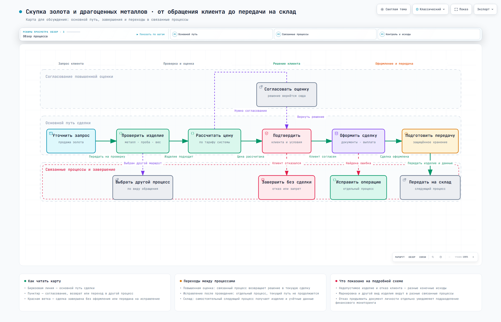

# Стандарт оформления бизнес-процессов и BPMN

Этот проект нужен, чтобы один и тот же бизнес-процесс был понятен и человеку, и разработчику:

- руководитель или сотрудник открывает простую карту и видит маршрут работы;
- аналитик берёт готовый шаблон и оформляет следующий процесс в тех же правилах;
- разработчик получает переносимый файл BPMN 2.0 и делает из него исполняемую версию под выбранный движок.

## Готовый пример

**Скупка золота и драгоценных металлов** — полностью оформленный пример процесса.

| Что открыть | Для кого | Что внутри |
|---|---|---|
| [Статическая карта процесса](processes/skupka-zolota/map/process-map.png) | Руководитель, сотрудник, аналитик | Короткий понятный маршрут без технических кодов; открывается прямо в GitLab |
| [Карточка процесса](processes/skupka-zolota/process-card.md) | Аналитик, владелец процесса | Цель, границы, роли, шаги, исключения и открытые вопросы |
| [Статическая BPMN-схема](processes/skupka-zolota/bpmn/derived/process.svg) | Аналитик, разработчик | Полная логика процесса; открывается прямо в GitLab |
| [Исходный файл BPMN 2.0](processes/skupka-zolota/bpmn/process.bpmn) | Разработчик | Нейтральный XML без привязки к конкретному движку |



## Как открыть интерактивные схемы

1. Клонируйте проект или скачайте его архивом из GitLab.
2. В Windows запустите файл `ОТКРЫТЬ-ПРОЕКТ.cmd` в корне проекта.
3. На стартовой странице выберите простую карту для чтения или подробный BPMN-навигатор с переходами в связанные процессы.

GitLab показывает статические PNG и SVG прямо в репозитории. Интерактивные HTML-файлы предназначены для локального открытия после скачивания проекта.

## Как работает переход в следующий процесс

Каждый процесс получает постоянный смысловой идентификатор. Вызов другого процесса в BPMN хранит этот же идентификатор в `calledElement`, а реестр связывает его с карточкой или готовой BPMN-схемой.

- если связанный BPMN-процесс уже зарегистрирован, навигатор открывает его подробную схему;
- если пока есть только описание, навигатор открывает понятную карточку будущего процесса;
- если цель неизвестна, связь честно помечается как неуточнённая и не подменяется догадкой.

Поэтому карточку-заглушку можно позже заменить полноценным процессным пакетом без переделки исходного процесса.

## Если нужно оформить новый процесс

1. Скопируйте папку [`templates/process-package`](templates/process-package).
2. Заполните карточку процесса обычным русским языком: кто начинает, что делает, где развилки и чем всё заканчивается.
3. Нарисуйте короткую карту для человека и подробную схему BPMN.
4. Зарегистрируйте переходы в другие процессы через реестр, не подменяя неизвестные связи догадками.
5. Выполните проверку и отправьте изменения через Merge Request.

Подробная инструкция: [как добавить новый процесс](docs/КАК-ДОБАВИТЬ-ПРОЦЕСС.md).

## Если нужно подключить процесс к BPMN-движку

Файл `process.bpmn` можно открыть в BPMN-редакторе и использовать как основу реализации. Эталонная схема специально хранится нейтральной и имеет `isExecutable=false`.

Для запуска разработчик создаёт отдельную исполняемую копию под конкретный движок, добавляет обработчики задач, формы, переменные, сообщения и технические ошибки. Эталонная бизнес-схема при этом не загрязняется расширениями одного поставщика.

Пошагово: [интеграция с BPMN-движком](docs/ИНТЕГРАЦИЯ-С-BPMN-ДВИЖКОМ.md).

## Что считается готовым

Есть два независимых результата:

- **модель готова к обсуждению и импорту** — XML валиден, схема читается, переходы и вопросы зарегистрированы;
- **процесс готов к исполнению** — создан адаптер под конкретный движок и пройдены интеграционные тесты в этом движке.

Первое не означает второе. Текущий пример технически проверен для импорта, но ещё не является утверждённым бизнес-регламентом и не развёрнут в процессном движке.

## Проверка проекта

На Windows запустите `ПРОВЕРИТЬ-ПРОЕКТ.cmd` или выполните:

```powershell
Set-Location tools\bpmn
npm ci
npm run verify:all
```

Проверяются структура пакета, JSON-схемы, BPMN-разбор, правила именования, доступность финалов, рендер через `bpmn-js` и навигация между процессами.

В GitLab каждый Merge Request автоматически проходит проверку структуры, BPMN и ссылок между процессами. Полная локальная проверка дополнительно строит изображения и открывает интерактивный навигатор в Chromium.

## Структура

```text
processes/   готовые процессы
templates/   шаблон нового процессного пакета
registry/    реестр процессов для переходов между схемами
docs/        правила моделирования и интеграции
tools/       воспроизводимые проверки и сборка представлений
```

Основные правила проекта: [стандарт оформления](docs/СТАНДАРТ-ОФОРМЛЕНИЯ.md).
