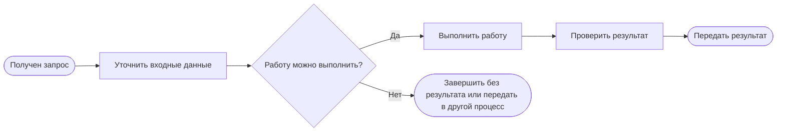

# Новый бизнес-процесс — карта для человека

```mermaid
flowchart LR
    A([Получен запрос]) --> B[Уточнить входные данные]
    B --> C{Работу можно выполнить?}
    C -->|Да| D[Выполнить работу]
    D --> E[Проверить результат]
    E --> F([Передать результат])
    C -->|Нет| G([Завершить без результата или передать в другой процесс])
```

Под схемой коротко поясните исключения и переходы в связанные процессы.
