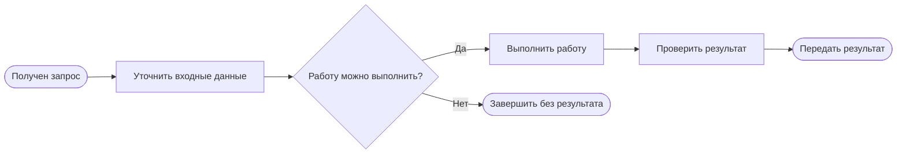

# Новый бизнес-процесс — карта для человека

Под схемой коротко поясните исключения. Если работа действительно уходит в другой самостоятельный процесс, добавьте в BPMN отдельный вызов или передачу сообщением и зарегистрируйте связь в метаданных — не подписывайте обычное завершение как переход.
